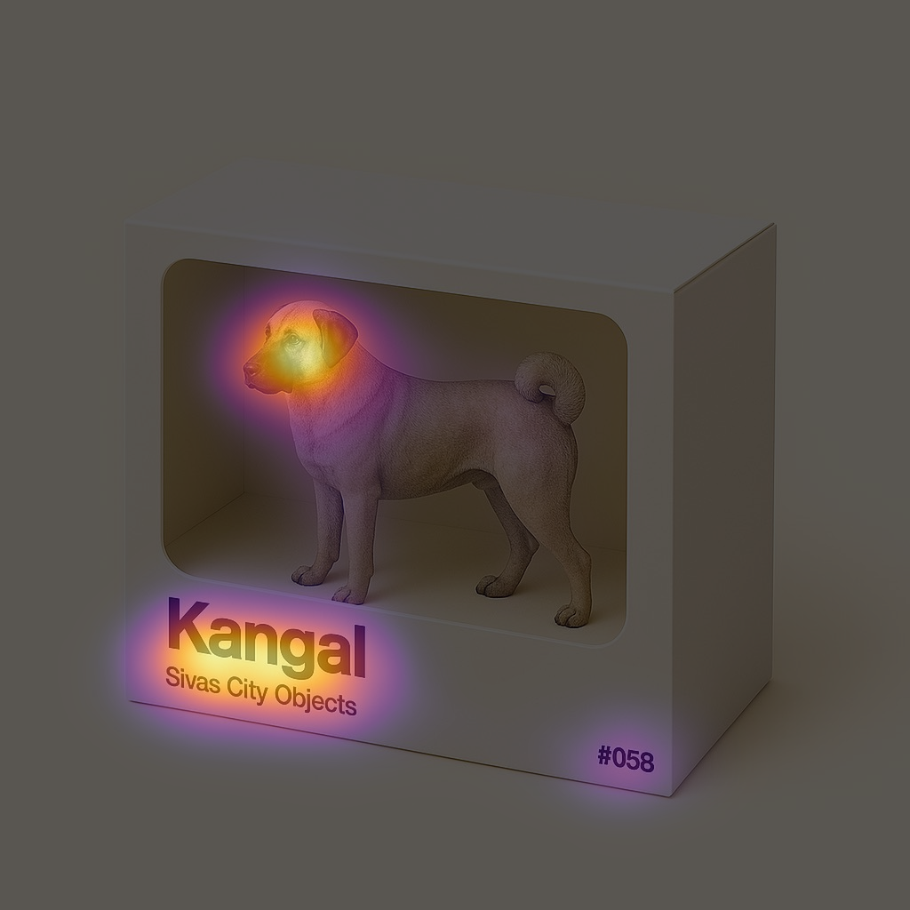

# 🧠 MSI-Net C++ / Python Inference

Run **[MSI-Net](https://huggingface.co/alexanderkroner/MSI-Net)** — a saliency detection network — fully offline with:

* ✅ **Python (TensorFlow)** reference inference
* ✅ **C++ (ONNX Runtime + OpenCV)** native, fast inference
* ✅ Pixel-by-pixel result comparison

Tested on **macOS Sonoma/Sequoia** for **M1/M2/M3**.

---



---

## 📦 1) Prerequisites

### Apple developer tools

```bash
xcode-select --install
```

### Homebrew (Apple Silicon)

```bash
/bin/bash -c "$(curl -fsSL https://raw.githubusercontent.com/Homebrew/install/HEAD/install.sh)"
echo 'eval "$(/opt/homebrew/bin/brew shellenv)"' >> ~/.zprofile
eval "$(/opt/homebrew/bin/brew shellenv)"
```

---

## ⚙️ 2) Install dependencies

### System packages (via Homebrew)

```bash
brew update
brew install cmake pkg-config opencv onnxruntime
```

### Python (venv)

```bash
python3 -m venv msi-net-venv
source msi-net-venv/bin/activate
pip install --upgrade pip
# Full TensorFlow includes SavedModel support
pip install tensorflow==2.* huggingface_hub opencv-python numpy<=1.23.4
```

> If you prefer Apple’s stack, `tensorflow-macos tensorflow-metal` work for many tasks but lack some SavedModel APIs used here.

---

## 📁 3) Project structure

```
cpp-playground/
├─ CMakeLists.txt            # C++ build config
├─ src/
│  └─ main.cpp               # C++ ONNX inference (OpenCV + ONNX Runtime)
├─ run_msi_tf.py             # Python TF reference runner
├─ compare_results.py        # Byte-perfect / tolerant comparator
├─ export_to_onnx.py         # (Optional) TF → ONNX converter
├─ models/
│  └─ msi_net.onnx           # exported model
├─ assets/
│  └─ example.jpeg           # test image
└─ build/                    # CMake build dir
```

---

## 🚀 4) Python: run MSI-Net

```bash
python run_msi_tf.py --image assets/example.jpeg --out_prefix tf_result
```

Outputs:

| File                | Description                   |
| ------------------- | ----------------------------- |
| `tf_result.npy`     | raw float32 saliency (H×W)    |
| `tf_result_u8.png`  | normalized uint8 saliency map |
| `tf_result_viz.png` | overlay (for viewing)         |

---

## ⚒️ 5) C++: build & run

### Build

```bash
cmake -S . -B build
cmake --build build -j
```

### Run

```bash
./build/msi models/msi_net.onnx assets/example.jpeg
```

Outputs:

| File                           | Description                                       |
| ------------------------------ | ------------------------------------------------- |
| `onnx_result_u8.png`           | normalized uint8 saliency map (matches Python)    |
| `onnx_result.exr` *(optional)* | float32 saliency for numeric checks               |
| GUI windows                    | input + saliency overlay (press any key to close) |

> The C++ code uses **NHWC float32** tensors to match TensorFlow and applies **identical** preprocessing, padding, and normalization (add 0.5 → floor → cast to `uint8`).

---

## 🧪 6) Compare results

```bash
python compare_results.py tf_result_u8.png onnx_result_u8.png
```

Expected:

```
IDENTICAL
```

Tolerant compare example:

```bash
python compare_results.py tf_result_u8.png onnx_result_u8.png --atol 1 --rtol 0
```

---

## 🔁 7) (Optional) Convert TF → ONNX

If `models/msi_net.onnx` is missing, run:

```bash
python export_to_onnx.py
```

This downloads the SavedModel and converts it to `msi_net.onnx` (opset 13 by default).

---

## 🧰 Troubleshooting

| Symptom                                                                  | Fix                                                                                                       |
| ------------------------------------------------------------------------ | --------------------------------------------------------------------------------------------------------- |
| `fatal error: onnxruntime_cxx_api.h not found`                           | In `CMakeLists.txt` include `/opt/homebrew/include/onnxruntime` and link `${BREW_PREFIX}/lib` (Homebrew). |
| TF: `AttributeError: module 'tensorflow' has no attribute 'saved_model'` | Use full `tensorflow==2.16.1` (not `tensorflow-macos`).                                                   |
| PNGs differ by 1 gray level                                              | Ensure C++ uses `+0.5 → floor → uint8` normalization (already in `main.cpp`).                             |
| GUI windows don’t appear                                                 | Run from Terminal (not headless), grant screen/window permissions if prompted.                            |

---

## 📜 CMake notes

Minimal lines relevant to ONNX Runtime + OpenCV (Homebrew):

```cmake
# Homebrew prefix
execute_process(COMMAND brew --prefix OUTPUT_VARIABLE BREW_PREFIX OUTPUT_STRIP_TRAILING_WHITESPACE)

find_package(OpenCV REQUIRED)

# ONNX Runtime headers & lib (Homebrew layout)
set(ONNXRUNTIME_INCLUDE_DIR "${BREW_PREFIX}/include/onnxruntime")
find_library(ONNXRUNTIME_LIB onnxruntime HINTS "${BREW_PREFIX}/lib" REQUIRED)

add_executable(msi src/main.cpp)
target_include_directories(msi PRIVATE ${OpenCV_INCLUDE_DIRS} ${ONNXRUNTIME_INCLUDE_DIR})
target_link_libraries(msi PRIVATE ${OpenCV_LIBS} ${ONNXRUNTIME_LIB})
```

---

## ⚡ Advanced: CoreML acceleration (optional)

ONNX Runtime can delegate to Apple’s **CoreML EP**. After installing an ORT build with CoreML EP, enable it in code roughly as:

```cpp
// Pseudocode (not enabled by default in this repo)
Ort::SessionOptions so;
// so.AppendExecutionProvider_CoreML(CoreMLFlags);
```

For initial simplicity and reproducibility, this project uses the default CPU EP.

---

## 🧠 Credits

* Model: **MSI-Net** by Alexander Kroner et al.
* Tooling: TensorFlow 2 · ONNX Runtime · OpenCV · CMake

Happy hacking! 🚀
